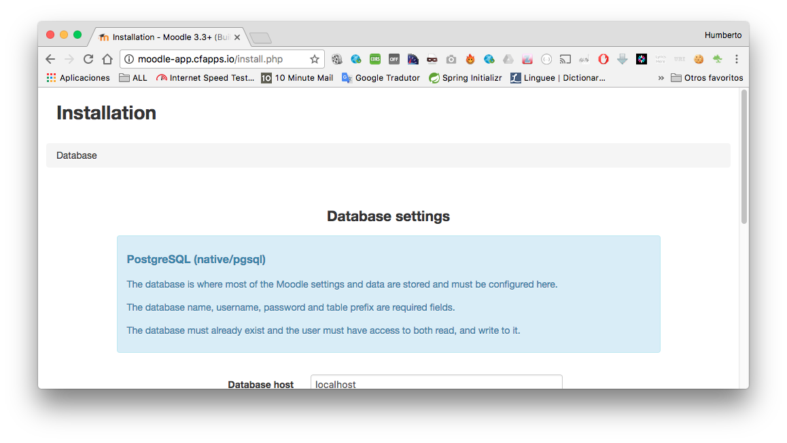

# Moodle on CF

Publishing last version of moodle on Cloud Foundry.

# Prerequires

1. CF account
2. CF Client

# How to deploy

Clone

```
git clone https://github.com/humbertodias/cloud-foundry-php-moodle.git
```
Inside

```
cd cloud-foundry-php-moodle
```

Moodle

```
curl -L https://github.com/moodle/moodle/archive/MOODLE_33_STABLE.tar.gz | 
tar xz
```


Static Configuration

```
cp manifest-pivotal.yml moodle-MOODLE_33_STABLE/manifest.yml
cp -R bp-config/. moodle-MOODLE_33_STABLE/.bp-config
```

Data

```
mkdir moodle-MOODLE_33_STABLE/moodledata
```


Login

API End
Pivotal: api.run.pivotal.io
Bluemix: api.ng.bluemix.net

```
cf login -a api.run.pivotal.io
```

Services

```
cf create-service elephantsql turtle elephant-sql-service
cf create-service sendgrid free sendgrid-service
```

Dynamic Configuration

```
cp config.php moodle-MOODLE_33_STABLE/config.php
```

Deploy

```
cd moodle-MOODLE_33_STABLE
cf push
```


# Started

[http://moodle-app.cfapps.io](http://moodle-app.cfapps.io)
or
[https://moodle-app.mybluemix.net](https://moodle-app.mybluemix.net)




# Reference

1. [CF + Moodle](http://blog.cloudfoundry.gr.jp/2015/11/cf100apps-097-moodle.html)
2. [CF scripting](http://www.starkandwayne.com/blog/admin-scripting-your-way-around-cloud-foundry/)
3. [PHP CF Helper](https://github.com/cloudfoundry-community/cf-helper-php)
4. [BlueMix Blog](https://www.ibm.com/blogs/bluemix/2014/06/getting-started-laravel-bluemix)
5. [BuildPack configuration](https://docs.cloudfoundry.org/buildpacks/php/gsg-php-config.html)